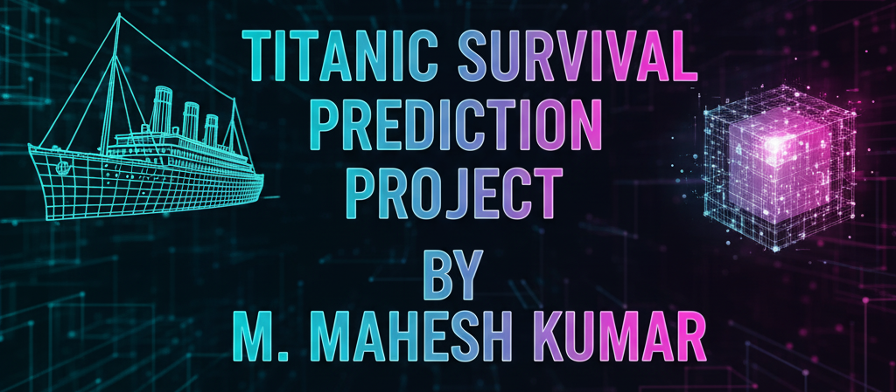
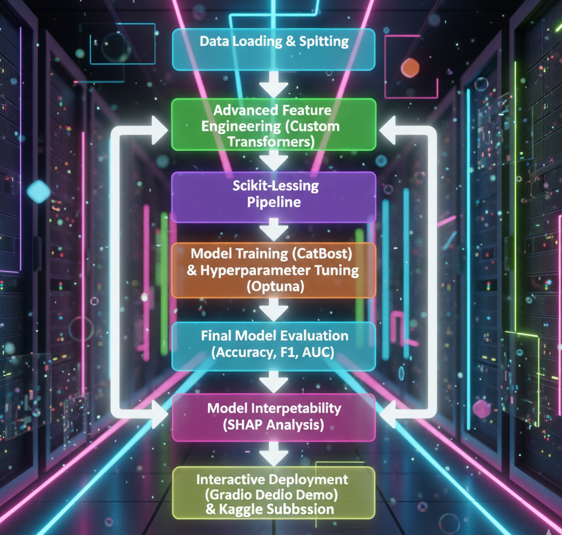
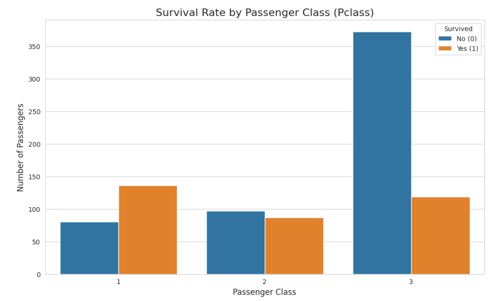
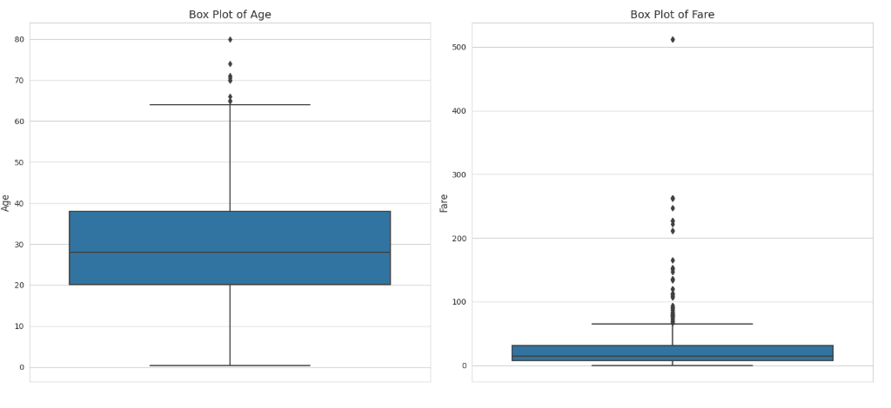
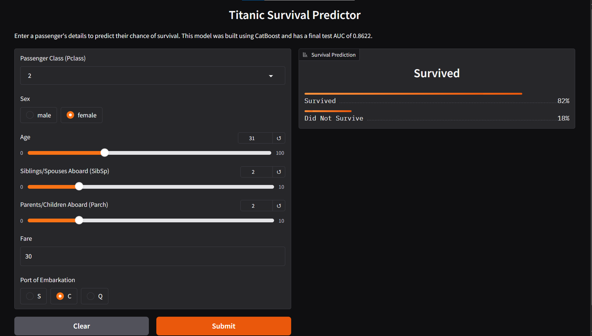

# Titanic Survival Prediction: An End-to-End MLOps Project

**Project Status: Completed**

This repository documents a complete, structured workflow for the Kaggle "Titanic: Machine Learning from Disaster" competition. It follows a rigorous, version-controlled methodology, moving from raw data to a fully trained, explained, and deployed interactive model.

The project's core philosophy is to demonstrate a professional machine learning lifecycle, emphasizing reproducibility, automation, and maintainability. It culminates in a champion model built with CatBoost, explained with SHAP, and deployed with Gradio.

---

### 🏆 Final Competition Score

*   **Official Kaggle Score:** **0.77033**
*   **Leaderboard Rank:** Achieved a score better than ~34% of all participants on the first submission, demonstrating a solid and robust baseline model.

This result highlights a common and important machine learning concept: the **Generalization Gap**. The model's performance on the hidden Kaggle test set (77.0%) was slightly lower than on our own validation set (~80-83%), which is an expected and normal outcome when generalizing to new, unseen data.

---

### Table of Contents
1.  [Key Technologies Used](#-key-technologies-used)
2.  [Project Objective](#-project-objective)
3.  [The Project Workflow](#-the-project-workflow)
4.  [Exploratory Data Analysis](#-exploratory-data-analysis)
5.  [Feature Engineering & The Core Pipeline](#-feature-engineering--the-core-pipeline)
6.  [Model Training & Evaluation](#-model-training--evaluation)
7.  [Model Explainability: Unlocking the Black Box](#-model-explainability-unlocking-the-black-box)
8.  [Interactive Demo with Gradio](#-interactive-demo-with-gradio)
9.  [How to Use This Repository](#-how-to-use-this-repository)
10. [Future Work: The Path to a Higher Score](#-future-work-the-path-to-a-higher-score)

---

### 🛠️ Key Technologies Used
- **Data Analysis & Manipulation:** `Pandas`, `NumPy`
- **Modeling:** `Scikit-learn`, `CatBoost`
- **Hyperparameter Tuning:** `Optuna`
- **Model Explainability:** `SHAP`
- **Interactive Demo:** `Gradio`
- **Version Control:** `Git` & `GitHub`

---

### 🚩 Project Objective

The primary objective was to build a reliable machine learning system to predict passenger survival on the Titanic. This involved two parallel goals:

1.  **Competition Goal:** To accurately predict survival and submit the results to the Kaggle competition.
2.  **Technical Goal:** To implement a professional, end-to-end MLOps workflow, demonstrating best practices for version control, feature engineering, pipelining, model evaluation, interpretability, and deployment.

---

### ⚙️ The Project Workflow

This project was built on a structured, iterative lifecycle. Every step was version-controlled with Git using Conventional Commits to ensure a clean and understandable project history.



---

### 📊 Exploratory Data Analysis

Before any modeling, a thorough EDA was performed to understand the dataset's characteristics and find predictive signals. The analysis confirmed well-known historical facts: survival was heavily influenced by social class and gender.

| Survival Rate by Passenger Class | Fare Distribution by Survival |
| :---: | :---: |
|  |  |

**Key Insights:**
1.  **Class Matters:** First-class passengers had a significantly higher chance of survival compared to third-class passengers.
2.  **Wealth is a Factor:** The median fare paid by survivors was substantially higher than that paid by those who did not survive.

---

### 🔬 Feature Engineering & The Core Pipeline

Based on EDA, a series of custom transformers were built to engineer new features. The heart of this project is a single, robust `scikit-learn` pipeline that encapsulates this entire process, ensuring reproducibility and preventing data leakage.

**Key Engineered Features:**
*   **`Title`:** Extracted from the `Name` column (e.g., 'Mr', 'Mrs', 'Miss'), which proved to be the most powerful predictive feature.
*   **`FamilySize` & `IsAlone`:** Created by combining `SibSp` and `Parch` to quantify a passenger's family connections.
*   **`Age*Class` & `FarePerPerson`:** Interaction features created to capture combined effects that are more predictive than individual features.

---

### 🎯 Model Training & Evaluation

A `CatBoostClassifier` was chosen for its excellent performance and built-in handling of categorical features. The final model was evaluated on the internal, held-out test set before submission.

| Metric         | Test Set Score |
| :------------- | :------------- |
| **AUC Score**  | **0.8622**     |
| Accuracy       | 0.7989         |
| F1-Score       | 0.7231         |

The strong AUC score demonstrates the model's excellent ability to distinguish between surviving and non-surviving passengers.

---

### 🧠 Model Explainability: Unlocking the Black Box

A model is only useful if we can trust it. **SHAP (SHapley Additive exPlanations)** was used to explain the final model's predictions. The plot below confirms that the model learned historically accurate patterns.

*(Note: This section requires your SHAP summary plot image)*
<!--  -->

**Key Drivers of Survival:**
1.  **Title & Sex:** The passenger's title ('Mrs', 'Miss' vs. 'Mr') and gender were the biggest predictors of survival.
2.  **Pclass:** Passengers in 1st Class had a much higher survival probability than those in 3rd Class.
3.  **Engineered Features:** Our custom features like `Age*Class` and `FarePerPerson` were also shown to be impactful.

---

### 🚀 Interactive Demo with Gradio

To make the model accessible, a simple web application was built using Gradio. This allows anyone to input a passenger's details and receive an instant survival prediction.



---

### 📖 How to Use This Repository

1.  **Clone the repository:**
    ```bash
    git clone https://github.com/munnurumahesh03-coder/Your-Repo-Name.git
    cd Your-Repo-Name
    ```
2.  **Explore the Notebook:**
    The `Titanic.ipynb` file contains the complete code for this project, from data loading to the Gradio demo.

---

### 🔮 Future Work: The Path to a Higher Score

While this project provides a robust baseline, the next steps to climb the Kaggle leaderboard would involve:

*   **Advanced Ensembling:** Combine the predictions of several different models (e.g., CatBoost, LightGBM, XGBoost ) to create a more powerful "wisdom of the crowd" prediction.
*   **Deeper Feature Engineering:** Investigate more complex features from the `Ticket` and `Cabin` columns.
*   **More Sophisticated Tuning:** Run a larger Optuna study (e.g., 200+ trials) to explore a wider hyperparameter space.
