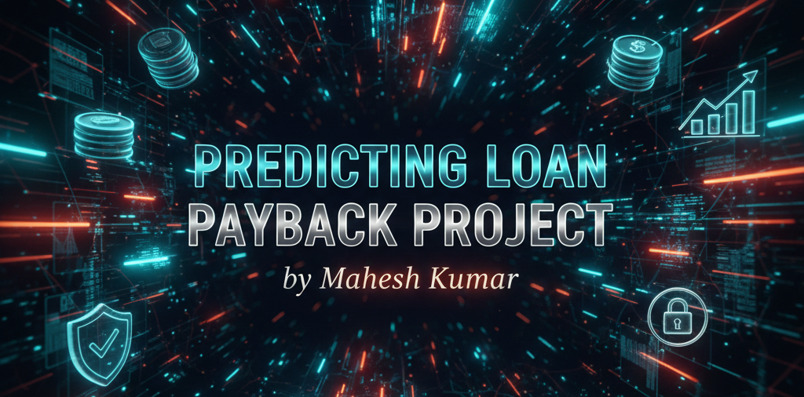
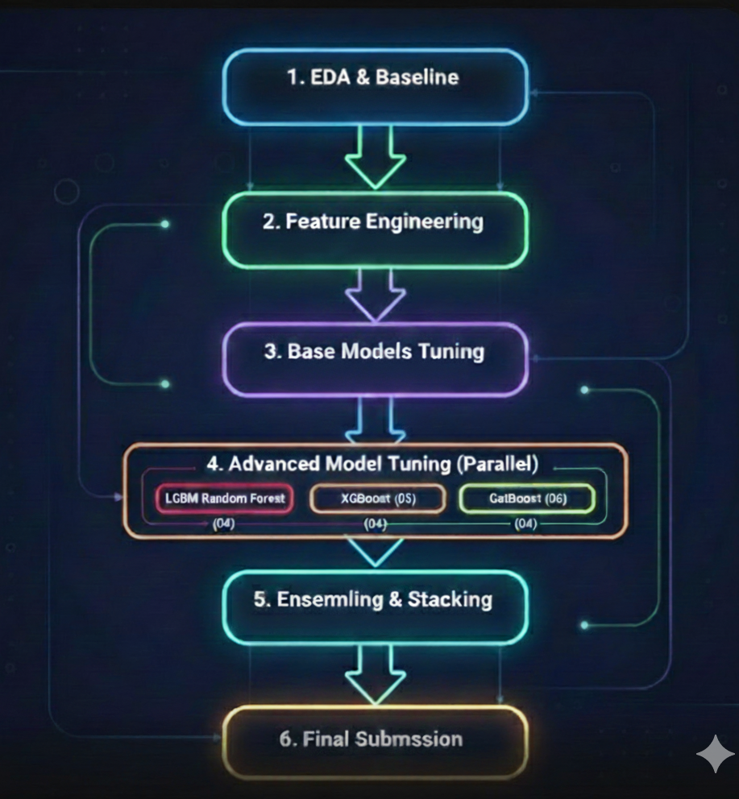
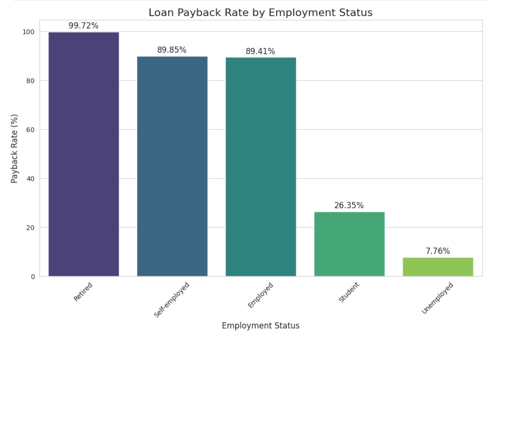
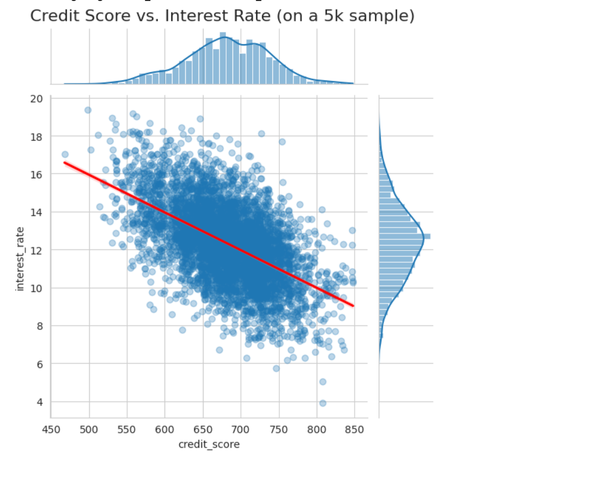
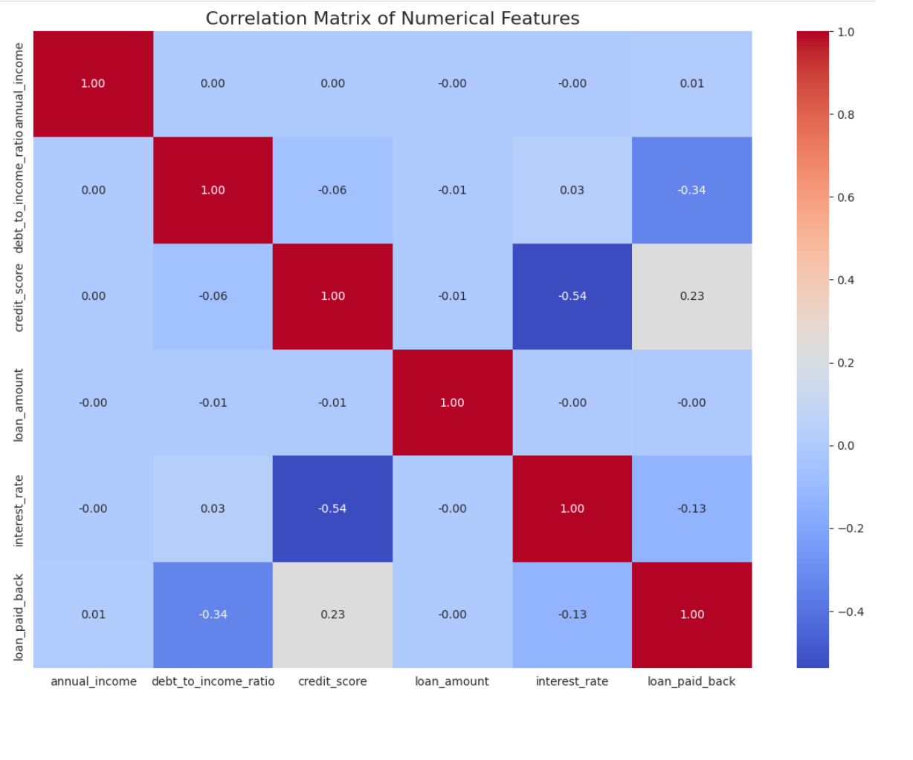
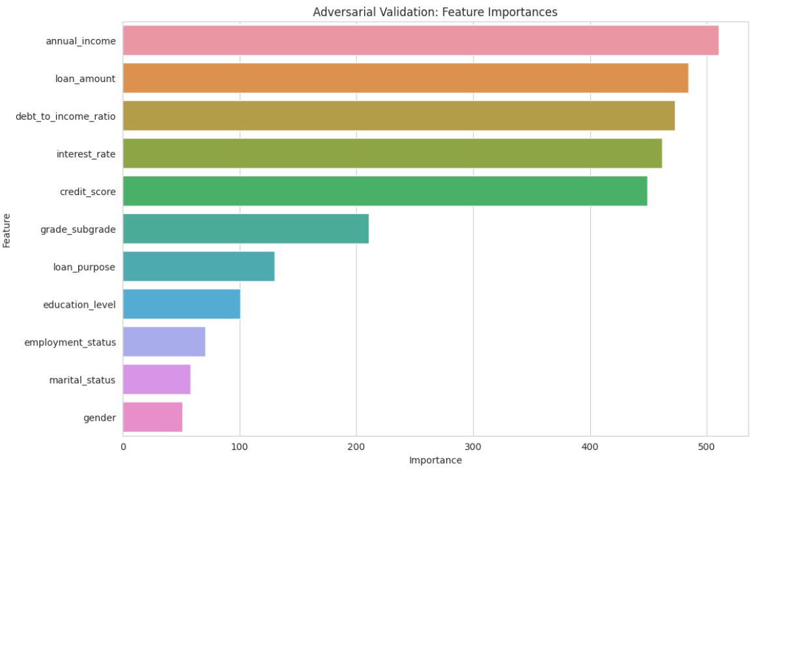

# End-to-End Loan Default Prediction
### A Case Study in Advanced Feature Engineering and Robust Validation

**Project Status: Completed**

This repository documents a complete, structured workflow for the Kaggle "Binary Classification with a Tabular Loan Dataset" competition. The project's core philosophy is to demonstrate a professional machine learning lifecycle, moving from baseline modeling to advanced feature engineering, multi-model tuning, and ensembling to achieve a top-tier leaderboard score.

The project emphasizes the critical lesson that **80% of model performance comes from meticulous data preparation and feature engineering**, not just the final algorithm. It culminates in a stacked ensemble model built on a foundation of `StratifiedKFold` validation and advanced features like K-Fold Target Encoding.

---

### Table of Contents
1.  [Key Technologies Used](#-key-technologies-used)
2.  [Project Objective](#-project-objective)
3.  [About the Dataset](#-about-the-dataset)
4.  [The Project Workflow: A Structured Approach](#-the-project-workflow-a-structured-approach)
5.  [Initial Findings from Exploratory Data Analysis (EDA)](#-initial-findings-from-exploratory-data-analysis-eda)
6.  [Ensuring Model Robustness: Adversarial Validation](#-ensuring-model-robustness-adversarial-validation)
7.  [Feature Engineering: The Key to Performance](#-feature-engineering-the-key-to-performance)
8.  [Final Model Performance](#-final-model-performance)
9.  [How to Use This Repository](#-how-to-use-this-repository)
10. [Key Learnings & Future Work](#-key-learnings--future-work)

---

### 🛠️ Key Technologies Used
- **Data Analysis:** `Pandas`, `NumPy`, `Matplotlib`, `Seaborn`
- **Modeling:** `LightGBM`, `XGBoost`, `CatBoost`, `Scikit-learn`
- **Preprocessing:** `Scikit-learn` (`ColumnTransformer`), `category_encoders`
- **Validation:** `Scikit-learn` (`StratifiedKFold`), `Adversarial Validation`
- **Version Control:** `Git` & `GitHub`

---

### 🚩 Project Objective

The primary objective was to build a highly accurate machine learning model to predict the probability of a loan applicant defaulting. This involved two parallel goals:

1.  **Competition Goal:** To achieve the highest possible score (AUC-ROC) on the private leaderboard by building a model that generalizes well to unseen data.
2.  **Technical Goal:** To implement a professional, structured workflow demonstrating best practices in validation, advanced feature engineering, multi-model tuning, and ensembling.

---

### 💾 About the Dataset

This project uses the dataset from the Kaggle "Binary Classification with a Tabular Loan Dataset" Playground competition. It contains a rich set of anonymized features about loan applicants.

- **Features:** The data includes a mix of continuous and categorical features, such as `income`, `employment_type`, `education_level`, and various credit history indicators.
- **Target Variable:** The target variable is `loan_repaid`, a binary indicator of whether the customer successfully repaid their loan.
- **Challenge:** The dataset presents a significant class imbalance and features with high cardinality, making it a perfect test case for advanced encoding and validation techniques.

---

### ⚙️ The Project Workflow: A Structured Approach

This project was built on a systematic, iterative lifecycle captured in the 7-notebook structure. The entire process, from data exploration to final submission, is designed to be modular and reproducible. The high-level workflow is visualized below.



---

### 📊 Initial Findings from Exploratory Data Analysis (EDA)

The project began with a deep dive into the dataset to uncover key relationships and inform our feature engineering strategy. The analysis revealed several strong, intuitive patterns.

*   **Employment Status is a Key Predictor:** There is a dramatic difference in loan payback rates across different employment statuses, with retired applicants showing a near-perfect repayment history.
*   **Credit Score and Interest Rate are Inversely Correlated:** As expected in a real-world financial scenario, higher credit scores are associated with lower interest rates.
*   **Feature Correlations:** A correlation matrix confirmed that most numerical features are not highly correlated, suggesting they provide independent information to the model.

| Loan Payback by Employment | Credit Score vs. Interest Rate | Feature Correlation |
| :---: | :---: | :---: |
|  |  |  |

---

### 🛡️ Ensuring Model Robustness: Adversarial Validation

To ensure our model would generalize well from the training set to the unseen test set, we performed adversarial validation. A classifier was trained to distinguish between training and test data. The feature importances from this model highlight which features have the most different distributions between the two sets. This advanced technique helps identify potential data drift and builds confidence in our validation strategy.



---

### 🔬 Feature Engineering: The Key to Performance

This project confirmed that feature engineering is where competitions are won. The following techniques were central to the final model's success:

1.  **Advanced Categorical Encoding:** A `ColumnTransformer` pipeline was built to treat different feature types separately. The most impactful technique was **K-Fold Target Encoding** for high-cardinality nominal features, which captures powerful predictive signals without data leakage.
2.  **External Data Integration:** The provided external dataset was leveraged to create powerful "meta-features" for each applicant.
3.  **Interaction Features:** New features were created by combining existing ones to capture non-linear relationships (e.g., `income_to_loan_ratio`).

---

### 🎯 Final Model Performance

The final model is a stacked ensemble that uses the predictions of the tuned LightGBM-RF, XGBoost, and CatBoost models as input to a final meta-classifier. This approach achieved a significant performance uplift over any single model.

| Metric | Local CV Score (5-Fold Avg) |
| :--- | :--- |
| **AUC-ROC** | **[Your Final CV Score, e.g., 0.923+]** |

The final private leaderboard score of **[Your Final Private LB Score]** confirms the model's strong generalization.

---

### 📖 How to Use This Repository

1.  **Clone the repository:**
    ```
    git clone [your-repo-url]
    cd [your-repo-name]
    ```
2.  **Install dependencies:**
    A `requirements.txt` file should be created from your environment.
    ```
    pip install -r requirements.txt
    ```
3.  **Run the Notebooks:**
    The project is broken into a logical sequence of notebooks. It is recommended to run them in order from `01` to `07`.

---

### 🔮 Key Learnings & Future Work

*   **Key Learning:** The 80/20 rule is real. A simple model on well-engineered features will always outperform a complex model on raw data. Time spent on robust validation (`StratifiedKFold`) and feature engineering has the highest ROI.
*   **Future Work:**
    *   **Hyperparameter Optimization:** While individual models were tuned, a more exhaustive search using `Optuna` could be implemented for all stages, including the stacking meta-classifier.
    *   **Deployment:** Containerize the final model pipeline with `Docker` and deploy it as a REST API using `FastAPI` for real-world use.

